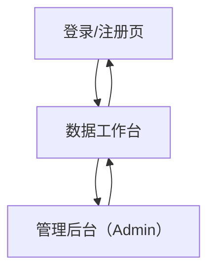

## 1. Product Overview
面向 QAR 数据的安全上传、加密存储与按权限解密下载系统。
你可以完成注册/登录，通过安全 Cookie 鉴权区分 admin 与普通用户，并复用既有加解密模块实现“加密上传、解密下载、管理员全量数据下载”。

## 2. Core Features

### 2.1 User Roles
| 角色 | 注册方式 | 核心权限 |
|------|----------|----------|
| 普通用户 | 邮箱/用户名 + 密码注册 | 登录后可加密上传自己的数据；查看与解密下载自己的数据 |
| Admin | 由系统预置/后续在管理后台提升角色 | 拥有普通用户全部能力；可管理用户角色；可查看与下载全量数据 |

### 2.2 Feature Module
本系统需求由以下主要页面构成：
1. **登录/注册页**：账号注册、登录、退出登录、Cookie 鉴权状态提示。
2. **数据工作台**：加密上传、我的数据列表、解密下载、下载策略/密钥参数录入（如需）。
3. **管理后台（Admin）**：用户与角色管理、全量数据列表、全量下载。

### 2.3 Page Details
| Page Name | Module Name | Feature description |
|---|---|---|
| 登录/注册页 | 注册 | 创建账号：录入用户名/邮箱与密码；校验必填与重复；成功后可直接登录或跳转登录 |
| 登录/注册页 | 登录 | 登录成功后服务端下发安全 Cookie（HttpOnly/Secure/SameSite）；跳转到数据工作台 |
| 登录/注册页 | 退出/会话状态 | 退出时清除 Cookie；未登录访问受保护页面时提示并跳转 |
| 数据工作台 | 加密上传 | 上传文件/文本数据；服务端复用既有加密模块进行加密；返回/保存密文与策略信息；展示上传结果摘要 |
| 数据工作台 | 我的数据列表 | 展示当前用户上传的数据记录（文件名、时间、大小、策略）；支持选择一条记录进行下载 |
| 数据工作台 | 解密下载 | 对选中记录发起下载；服务端在鉴权通过后解密并以文件形式返回；失败时给出可理解错误（无权限/数据不存在/解密失败） |
| 管理后台（Admin） | 用户与权限 | 查看用户列表；将用户设置为 admin 或普通用户；防止普通用户访问管理后台与管理接口 |
| 管理后台（Admin） | 全量数据管理 | 查看全量数据记录；支持按时间/用户筛选（基础筛选即可）；支持单条或批量下载 |
| 管理后台（Admin） | 全量下载 | 一键导出全部数据（按需求可为解密后导出或密文导出）；导出过程需鉴权且仅 admin 可用 |

## 3. Core Process
**普通用户流程**：
1) 打开登录/注册页，完成注册或登录。
2) 登录成功后由服务端写入安全 Cookie，会话生效。
3) 进入数据工作台：上传数据 → 服务端加密并存储 → 在“我的数据列表”可见。
4) 选择一条数据记录 → 发起下载 → 服务端鉴权通过后解密并返回下载文件。
5) 退出登录：清除 Cookie，回到登录页。

**Admin 流程**：
1) Admin 登录后进入数据工作台。
2) 访问管理后台：管理用户角色（提升/降级）。
3) 在全量数据管理中查看全量记录并执行“全量下载/批量下载”。

