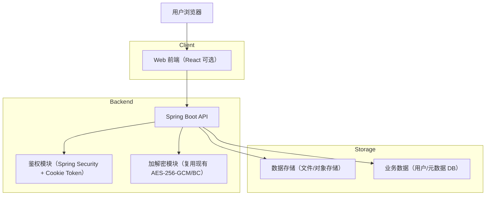
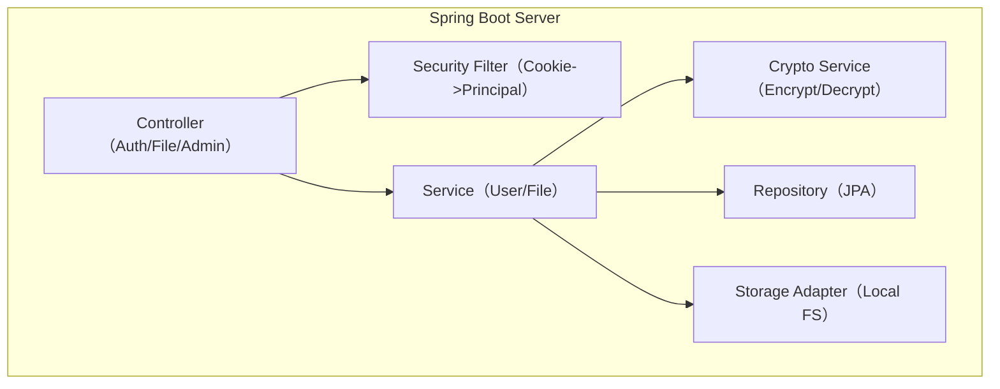
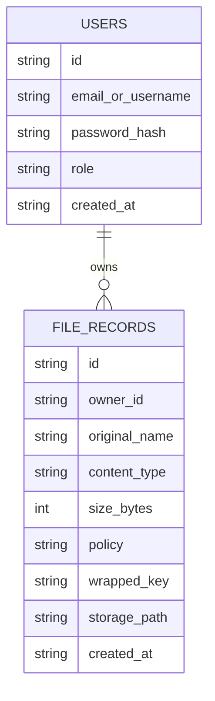

## 1.Architecture design


## 2.Technology Description
- Frontend（可选但推荐）: React@18 + TypeScript + vite + fetch/axios
- Backend: Java + Spring Boot（现有项目） + Spring Web
- Security: Spring Security + JWT（或自签名 Session Token）放入 HttpOnly Cookie
- Crypto: BouncyCastle（现有控制器已在用）+ AES-256-GCM（现有实现）
- Persistence（用于账号、角色、文件元数据）: Spring Data JPA + PostgreSQL（生产）/ H2（本地）
- File Storage: 本地磁盘目录（MVP），或后续替换为对象存储

## 3.Route definitions
| Route | Purpose |
|---|---|
| /auth | 登录/注册页（合并呈现） |
| /workbench | 数据工作台：加密上传、我的数据列表、解密下载 |
| /admin | 管理后台：用户/角色管理、全量数据管理、全量下载 |

## 4.API definitions (If it includes backend services)
### 4.1 Core API
认证与会话（Cookie）
- POST /api/auth/register
- POST /api/auth/login
- POST /api/auth/logout
- GET  /api/auth/me

数据上传/下载
- POST /api/files (multipart)
- GET  /api/files (list mine)
- GET  /api/files/{id}/download (decrypt + download; owner or admin)

管理接口（仅 admin）
- GET  /api/admin/users
- PATCH /api/admin/users/{id}/role
- GET  /api/admin/files
- GET  /api/admin/files/export (download all)

TypeScript 类型（前后端共用，若有前端）
```ts
export type UserRole = 'admin' | 'user'

export interface User {
  id: string
  emailOrUsername: string
  role: UserRole
  createdAt: string
}

export interface FileRecord {
  id: string
  ownerId: string
  originalName: string
  contentType: string
  sizeBytes: number
  policy: string
  wrappedKey: string
  storagePath: string
  createdAt: string
}
```

Cookie 安全约束（关键点）
- Cookie: HttpOnly + Secure + SameSite=Lax/Strict（按跨站需求选择）
- Token: 短有效期；登出时服务端失效（黑名单/版本号/refresh 轮转，MVP 可先做最小可用）
- CSRF: 若采用 Cookie 携带鉴权，建议启用 CSRF 防护或使用双提交 Cookie（按前端集成方式确定）

## 5.Server architecture diagram (If it includes backend services)


## 6.Data model(if applicable)
### 6.1 Data model definition


### 6.2 Data Definition Language
Users（users）
```
CREATE TABLE users (
  id VARCHAR(64) PRIMARY KEY,
  email_or_username VARCHAR(255) UNIQUE NOT NULL,
  password_hash VARCHAR(255) NOT NULL,
  role VARCHAR(20) NOT NULL,
  created_at TIMESTAMP DEFAULT CURRENT_TIMESTAMP
);
```

文件元数据（file_records）
```
CREATE TABLE file_records (
  id VARCHAR(64) PRIMARY KEY,
  owner_id VARCHAR(64) NOT NULL,
  original_name VARCHAR(255) NOT NULL,
  content_type VARCHAR(100),
  size_bytes BIGINT NOT NULL,
  policy VARCHAR(255),
  wrapped_key TEXT,
  storage_path TEXT NOT NULL,
  created_at TIMESTAMP DEFAULT CURRENT_TIMESTAMP
);

CREATE INDEX idx_file_records_owner_id ON file_records(owner_id);
CREATE INDEX idx_file_records_created_at ON file_records(created_at);
```

加解密复用说明（对齐现有代码）
- 现有接口位于 /api/encrypt、/api/decrypt、/api/encrypt-excel、/api/decrypt-excel，采用 AES/GCM/NoPadding + BouncyCastle。
- 新的“上传/下载”流程应直接调用同一套 AES-256-GCM 加解密逻辑（建议沉淀为 CryptoService），避免出现两套加密实现。
