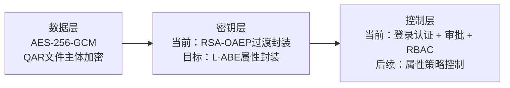
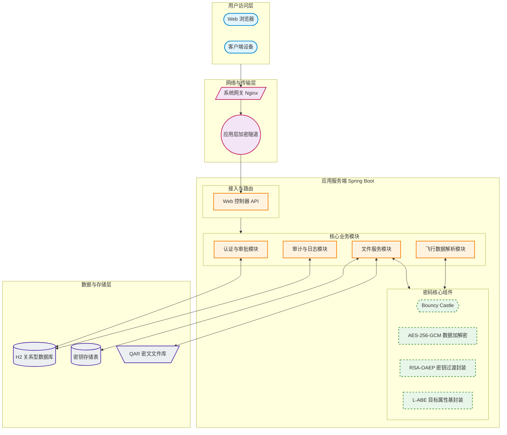
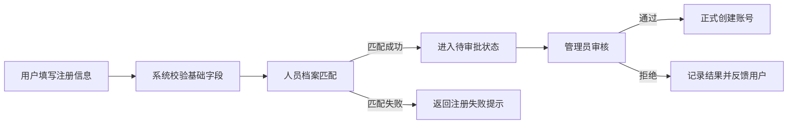
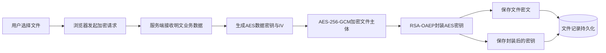
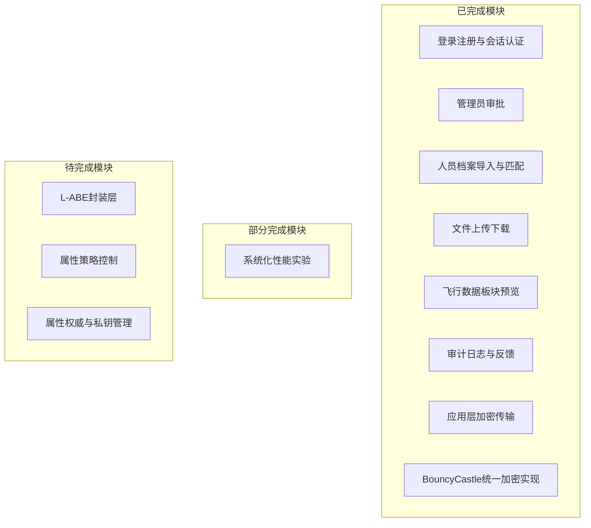

# 大学生创新创业训练计划项目 · 中期检查研究报告

## 一、项目基本信息

- **项目名称**：面向航空运维数据的后量子安全存储与可控共享原型系统
- **项目类型**：创新训练项目
- **项目负责人**：闫博泉
- **项目成员**：王薇茗、陈高、传佳钰、欧阳嘉森
- **指导教师**：钟安鸣
- **项目执行时间**：[待填写] 至 [待填写]
- **项目依托单位**：安全科学与工程创新创业实践基地

## 二、项目概况与中期任务定位

本项目围绕航空运维数据安全共享这一具体应用场景展开，目标不是做一个普通的文件管理系统，而是构建一套面向QAR数据的安全存储与可控共享原型。系统最终目标是形成“QAR文件主体由AES-256-GCM加密、AES数据密钥由L-ABE按属性策略封装”的后量子安全共享结构，使航空运维数据在长期存储和跨主体使用过程中，同时具备较强的数据机密性、访问可控性和后续向后量子密码迁移的可行路径。

本阶段工作的重点不在于继续扩展选题背景和文献综述，而在于围绕项目当前已完成工作、研究方法、关键验证结果、尚存差距以及下一阶段推进方向展开系统总结。因此，本文重点聚焦于项目现阶段的原型实现、密码结构设计方法、工程推进过程、阶段成果、存在问题和后续规划。

当前项目已经完成一个可运行的单体Web原型系统。系统围绕“文件密文存储、密钥独立封装、用户准入控制、应用层加密传输、服务端按需解密预览、日志审计与异常反馈”这一主线组织实现，已经具备实际演示能力。中期阶段的主要价值，在于把最终目标所依赖的系统结构先做出来，让后续L-ABE的接入不再停留于抽象方案，而能够建立在已验证的系统基础之上。

综上，项目当前的中期任务定位是：以可运行原型系统为载体，采用过渡性密码封装方案先完成系统级链路验证，并为最终实现L-ABE封装AES密钥打下工程基础。后续研究工作也将继续围绕这一主线展开。

### 2.1项目组团队状况

从团队组成看，项目目前形成了以负责人统筹推进、成员按模块协同完成任务的基本工作格局。项目负责人闫博泉主要承担总体技术路线把控、密码方案梳理、阶段任务拆解和关键问题攻关等工作，在中期阶段承担了较多的方案设计、代码整合和文档组织任务。其余成员王薇茗、陈高、传佳钰、欧阳嘉森围绕系统实现、功能联调、界面交互、资料整理、测试验证和问题复现等方面参与项目推进，团队整体保持了较为稳定的投入状态。

从精力投入情况看，项目组在中期阶段并不是停留于分散式参与，而是围绕原型系统开发这一主线持续投入。由于本项目同时涉及密码方案理解、系统实现、前后端联调和问题排查，工作内容具有明显的交叉性和阶段性，因此团队实际采用的是“关键节点集中投入 + 日常持续跟进”的方式推进。即在系统框架搭建、加密链路改造、审批流程修复、飞行数据板块恢复等关键任务阶段，成员会集中配合完成联调与验证；在非关键节点阶段，则以资料整理、问题记录、局部测试和文档补充等方式保持连续推进。整体来看，团队投入程度能够满足当前中期任务要求，没有出现完全停滞或长期失联的情况。

从协作方式看，团队并未简单采用机械分工，而是更强调围绕同一原型系统进行协同迭代。一方面，项目负责人负责将整体任务拆分为密码结构设计、业务流程实现、测试验证和文档支撑等若干部分，便于成员在不同阶段明确重点；另一方面，各成员在实际推进中又并非完全割裂，而是在遇到链路级问题时共同参与定位和修正。例如，某些问题表面上属于前端提示异常，但根因可能出在后端异常处理或加密传输逻辑上；某些问题表面上属于文件上传失败，但实际又与数据库字段设计和密钥封装结果相关。因此，团队在协作中逐渐形成了“先定位链路、再划分责任、最后回到整体联调”的工作方式，这有助于避免项目被拆成互不关联的局部模块。

从当前执行效果看，团队协作总体较为顺畅，已经能够支撑项目从早期设想到中期原型的持续推进。当前系统能够完成注册审批、档案匹配、文件密文存储、应用层加密传输、飞行数据明文预览和日志审计等一系列联动功能，本身就说明团队协作已经不仅停留在任务分派层面，而是开始具备围绕同一研究目标进行持续配合的能力。当然，团队目前仍以学生项目组为主体，在后续推进L-ABE集成、属性模型设计和系统化实验时，仍需要进一步提升任务分工的精细度和技术讨论的系统性。但从中期阶段的实际情况看，项目组整体执行状态较好，具备继续推进后续研究任务的基础。

## 三、研究方法与实施路径

### 3.1总体研究方法

本项目采用“目标分层、原型先行、渐进替换、边做边验证”的研究思路推进整体工作。具体而言，项目没有将“后量子安全共享系统”作为一个不可拆分的大目标一次性完成，而是将其拆分为数据层加密、密钥层封装、访问控制、前后端传输协同、明文预览与审计闭环等若干可逐步打通的子任务。研究过程中始终坚持优先构建可运行原型，在真实业务流程中验证方案有效性；同时以工程成熟度较高的RSA-OAEP先行验证密钥独立处理结构，再为后续替换至L-ABE目标封装层预留接口。每完成一个关键环节，均通过功能验证、问题定位和结构修正来检验其是否具备继续扩展的基础。

这一方法之所以适合本项目，原因在于项目目标天然兼具密码学复杂性和系统工程复杂性。若只关注密码算法本身，容易出现算法设想与系统实现脱节的问题；若只关注业务系统本身，又容易停留在普通文件管理平台层面，无法体现项目的学术目标和技术路线。因此，本项目从一开始就把研究方法落在“密码方案与工程系统双线协同”这一原则上，使当前原型既服务于中期答辩展示，也为后续深化研究预留清晰接口。

### 3.2分层密码结构方法

项目当前采用分层密码结构组织整体方案。数据层负责保护QAR文件主体内容，现阶段已经采用AES-256-GCM完成实现，以兼顾数据机密性和完整性检测能力。密钥层负责对AES数据密钥进行独立封装，使文件内容加密与密钥管理相互分离，当前通过RSA-OAEP这一过渡性方案验证密钥可独立处理、独立传输和独立持久化的系统链路。控制层负责用户准入与访问约束，现阶段主要依托登录认证、管理员审批和RBAC角色控制实现，后续将逐步向属性策略控制演进。

**图1分层密码结构示意图**



图1展示了项目当前采用的分层密码结构。该结构将文件主体保护、密钥封装和访问控制区分为三个层次，有助于在保持数据层稳定的前提下，逐步将密钥层由过渡性方案演进为最终的L-ABE封装方案。

这种分层方法有两个直接好处。其一，它使项目避免陷入“一旦密码方案变化，整个系统都要重做”的被动局面。只要数据层与密钥层边界清晰，后续就可以在不推翻整个文件处理流程的前提下替换密钥封装方案。其二，它使研究任务更加清楚。中期阶段可以先验证数据层与密钥层分离是否成立、传输链路是否成立、业务可用性是否成立；后续阶段再把精力集中到L-ABE的属性设计、策略表达和密钥管理问题上。

### 3.3原型驱动的系统实现方法

项目采用原型驱动的系统实现方法，而非停留在论文式模块拆分层面。后端以Spring Boot为核心框架，优先实现与业务闭环直接相关的模块，包括用户认证、管理员审批、人员档案匹配、文件上传下载、飞行数据预览、日志记录和异常处理。前端采用原生JavaScript完成页面交互和请求协同，重点支撑应用层加密传输及密文数据交互。数据库当前使用H2内存模式，主要服务于中期开发和验证节奏，便于快速复现问题、清理状态并完成多轮功能迭代。

采用原型驱动方法的原因，在于本项目需要面对的并不是单点算法验证，而是一个从注册登录、审批准入、文件上传、密文保存、数据预览到异常反馈都必须连贯可用的系统过程。若没有原型系统支撑，很多关键问题无法提前暴露，例如：文件加密后是否还能正常预览、密钥封装后数据库字段是否足够、前后端请求一旦引入加密后错误提示是否还能定位、密文存储之后后台管理功能是否仍然可用。这些问题都不是仅靠理论设计能够解决的，必须通过原型运行来暴露和修正。

### 3.4渐进替换与最终目标对接方法

项目在技术路线上采用渐进替换方法连接当前原型与最终目标。现阶段工作的重点不是直接宣称完成L-ABE，而是先围绕最终目标所必需的系统结构进行铺设，包括文件密文存储、AES密钥独立封装、应用层传输中的密钥封装链路、服务端按需解密以及围绕用户身份和档案字段的准入控制。后续阶段将在此基础上完成属性集合设计、属性策略表达、属性权威和属性私钥管理，并逐步将当前RSA过渡封装替换为L-ABE封装层。

这种方法的价值在于，它把“最终目标实现”从一种一次性跃迁，转化为一条可分阶段推进的工程路径。当前完成的工作并不会因为后续接入L-ABE而被推翻，反而会成为后续研究的承载平台。换言之，中期原型并不是最终目标的替代品，而是最终目标的前置工程基础。

### 3.5验证与修正方法

在研究推进过程中，项目采用“功能验证 + 问题定位 + 结构修正”的迭代方法。具体做法是：每完成一个模块，就围绕真实业务场景进行验证；一旦发现链路级问题，不是简单绕过，而是尽量回到结构层分析根因并完成修复。例如，管理员审批流程中的权限异常、前后端异步请求中的CSRF兼容问题、加密上传中的字段长度问题、人员档案与CSV不同步问题、飞行数据板块在密文存储后无法继续预览的问题，都是在这一方法下被逐步暴露和解决的。该方法保证了项目不是“写到能跑就停”，而是通过持续修正使系统逐步具备更高的一致性和可展示性。

## 四、当前工作进展

### 4.1系统原型整体搭建进展

截至目前，项目已经完成一个可运行的单体Web原型系统。系统后端承担认证授权、审批管理、文件服务、飞行数据解析、日志审计和异常处理等任务；前端承担页面展示、交互逻辑和加密传输协同；数据库承担用户、档案、文件记录和日志等信息的存储。当前系统运行端口为 `8101`，已经具备登录、注册、审批、文件上传下载、数据统计和飞行数据预览等基础功能。就中期阶段而言，这意味着项目已经从“方案设计和局部验证”推进到“原型级系统联调与演示”阶段。

当前原型的一个显著特点，是多个安全模块已经被实际纳入同一条业务链路中，而不是彼此孤立。例如，用户注册不仅是前端页面提交，而是与人员档案匹配和管理员审批联动；文件上传不仅是业务接口，而是与应用层加密传输、文件密文存储和密钥封装链路联动；飞行数据板块不仅是预览页面，而是与服务端解封装、解密和xlsx解析联动。这种跨模块联动能力说明，项目当前已经具备较为完整的系统级运行基础。

**图2系统总体架构示意图**



图2展示了当前原型系统的总体架构。前端、传输层、业务层和数据层之间已形成较为完整的联动关系，说明项目当前并非停留在单点功能实现，而是已经具备系统级运行和展示基础。

### 4.2用户准入、认证与审批模块进展

项目已经完成以用户身份核验为基础的账号准入流程。用户在注册时需要提交工号、姓名、身份证后四位、联系方式、航司、岗位和部门等信息，系统会先根据人员档案库进行匹配，匹配成功后申请进入待审批状态，再由管理员进行审核。审批通过后，用户账号正式创建。该流程保证了系统不是开放注册模式，而是在业务字段约束下进行身份准入。

在认证与会话管理方面，当前系统已经具备基础会话维持能力，并围绕角色权限对管理员与普通用户的访问边界进行了区分。虽然目前仍属于RBAC为主的控制方式，但从中期阶段看，这一设计已经足以支撑原型演示和模块联调，也为后续把业务字段进一步抽象为属性提供了现实基础。

项目推进过程中，审批模块还经历了多轮修正。早期系统在管理员通过注册申请时出现“无权限访问”问题，说明权限匹配规则与接口实际行为之间存在偏差。通过重新梳理安全配置、权限表达方式和前后端协同方式后，审批流程恢复正常。这一问题的解决说明当前系统在准入链路上已经完成从“功能存在”到“流程可用”的提升。

**图3用户注册与审批流程图**



图3展示了当前系统的用户注册与审批流程。该流程体现了项目在中期阶段已经将身份核验、档案匹配和管理员审批整合为统一准入机制，而非采用完全开放的注册方式。

### 4.3人员档案导入与业务字段匹配进展

为了使准入控制建立在真实业务字段基础上，项目引入了人员档案种子数据，并以 `person_seed.csv` 为主要导入来源。系统启动后能够根据档案数据补齐人员信息，注册时也可据此校验工号和基本身份信息。这一设计不仅服务于当前账号审核流程，也为未来构建基于航司、岗位、部门等字段的属性模型提供了先验数据来源。

在实际开发中，人员档案模块曾暴露出一个典型问题，即“工号明明存在于CSV中，但系统仍提示档案库中未找到该学号或工号”。经过排查后发现，问题并不在匹配逻辑本身，而在于早期导入策略只在数据表为空时整批导入，导致运行中的数据库状态与CSV更新内容不一致。项目后续将导入策略改为启动时补齐缺失工号，并在上传流程中增加兜底加载，这一改造显著提高了人员档案与系统运行状态的一致性。

这一进展具有方法层面的意义。它说明项目并非只把人员档案当作“注册附属模块”，而是逐步把档案字段视为未来属性控制模型的重要输入。中期阶段先解决档案一致性问题，后续阶段才能继续讨论属性提取和策略表达的问题。

### 4.4文件密文存储与密钥独立封装进展

文件密文存储是当前项目最核心的中期成果之一。早期系统中文件处理更接近普通上传模式，而当前系统已将文件主体改造为密文存储：文件上传后，服务端会先生成AES数据密钥和随机IV，再使用AES-256-GCM对文件内容完成加密，最后将密文写入存储字段。这样一来，文件主体不再以明文形式长期留存在系统中，数据保护能力与项目目标之间建立了更直接的联系。

与传统“只把文件内容加密一下”的做法不同，项目同时将AES数据密钥从文件主体处理中剥离出来，交由独立封装逻辑处理。当前阶段采用RSA-OAEP对AES密钥进行过渡性封装，这样做的目的不是把RSA写成最终目标，而是验证以下几个关键问题：第一，文件主体加密与密钥封装是否能够在系统中分层组织；第二，AES密钥是否能够被安全地单独存储和提取；第三，未来是否可以在不改动文件主体加密方式的前提下，替换密钥层方案。

这一部分工作在实现过程中也并非简单顺利。系统曾在上传过程中出现 `data_too_large_or_invalid` 类错误，进一步定位后发现，RSA封装后的Base64结果长度超出了原始数据库字段设计范围。项目后续将相应字段改为适合大对象内容保存的形式，从而恢复了上传链路。这一问题说明，密钥独立封装不仅是密码逻辑改造，还会直接影响数据库字段设计和数据模型边界。能够在中期阶段发现并修复这类问题，恰恰体现了原型验证的价值。

**图4文件加密上传与密文存储流程图**



图4展示了当前文件加密上传与密文存储的主要处理过程。该图直观反映了文件主体与数据密钥分层处理的实现方式，也说明当前过渡性封装方案已经能够支撑完整上传链路运行。

### 4.5应用层加密传输链路进展

除文件静态存储之外，项目还在传输链路上完成了应用层加密传输原型。需要特别说明的是，当前实现并不是标准TLS/HTTPS协议本身，而是一套用于验证请求级加密交互是否可行的应用层机制。其大致过程为：客户端先通过握手接口获取服务端公钥；随后在每次请求前由浏览器端动态生成临时AES密钥；客户端使用该临时AES密钥加密请求体，并通过服务端公钥对该AES密钥进行封装；服务端收到请求后先解封装临时AES密钥，再解密请求体并交给业务逻辑处理；处理完成后，服务端再使用相同临时AES密钥加密响应内容。

当前链路的意义主要体现在工程验证层面。项目希望通过这一机制证明：前后端在不依赖固定会话明文密钥的情况下，仍可围绕“临时对称密钥 + 公钥封装”的方式完成数据交互；同时，传输层中的密钥处理逻辑也可以保持与存储层中的密钥独立封装思路一致。未来无论当前封装方式继续优化，还是进一步替换为更复杂的后量子封装机制，这一链路验证结果都具有参考价值。

在实现过程中，应用层加密传输也暴露出多项细节问题，例如早期错误信息过于模糊、前端只回显“请求失败，请稍后重试”、重握手失败时缺少明确提示等。项目后续通过新增统一异常处理、前端错误映射以及重试逻辑，使这一路径从“理论可写”逐步变为“工程可调试、可展示”。中期阶段能够把传输层问题从黑盒状态改造成可定位、可修复状态，本身就是进展的重要体现。

**图5中期阶段关键数据处理链路示意图**


图5展示了项目中期阶段已经打通的关键数据处理链路。该链路说明系统不仅完成了文件加密这一局部工作，还将准入控制、传输保护、业务处理、存储保护和反馈闭环组织为连续流程。

### 4.6飞行数据板块与明文预览能力进展

项目的业务展示重点之一是飞行数据板块。该板块之所以重要，是因为它直接验证了“文件底层已加密，系统是否仍能在合法场景下提供可视化数据处理能力”。在文件改为密文存储之后，原先直接读取存储字段并解析xlsx的方式失效，导致飞行数据板块一度无法显示明文数据。这一问题如果不解决，系统就会停留在“能加密存储，但影响业务使用”的阶段。

针对这一问题，项目对飞行数据板块进行改造，使其在预览请求到来时，不再直接将底层字段当作明文文件处理，而是先通过文件服务完成解封装和解密，再将恢复出的明文xlsx交由解析逻辑处理。经过该改造后，系统恢复了飞行数据板块的明文可视化能力。

这一进展具有明显的中期说明意义。因为项目当前并不只是证明“安全性提高了”，而是在证明“系统可以在安全增强之后继续可用”。对于面向航空运维数据的系统而言，若加密机制阻断了后续数据分析、预览和管理，那么即便安全性提升，也不具有真正的工程价值。当前飞行数据板块的恢复，说明项目已经开始正面处理安全与可用性的平衡问题。

**图6飞行数据预览处理流程图**


图6展示了飞行数据板块恢复明文展示能力后的处理流程。该流程表明，系统已经实现“底层密文存储、业务层按需解密、展示层可视输出”的处理模式。

### 4.7审计日志、异常处理与反馈闭环进展

项目在中期推进中还逐步补全了审计日志、统一异常处理和前端错误映射等支撑模块。审计日志用于记录关键用户操作、管理动作和部分系统行为，为问题追踪、运行分析和后续责任追溯提供依据。统一异常处理则避免后端将底层异常直接暴露为不可理解的失败信息，使前端能够根据错误类型提供更清晰的中文提示。

这部分工作虽然不直接等同于密码算法研究，但对项目整体推进非常重要。原因在于，密码相关系统一旦出现链路异常，往往比普通业务系统更难定位；如果没有日志和结构化错误信息支撑，开发和调试成本会显著提高。当前项目已经在这一方面建立基础闭环，使系统从“能跑”进一步提升为“遇到问题时可以分析和修正”，这一点对于后续接入更复杂的L-ABE至关重要。

### 4.8当前模块完成情况

截至目前，项目主要模块完成情况如下表所示。

| 模块 | 当前状态 | 说明 |
| --- | --- | --- |
| 登录注册与会话认证 | 已完成 | 已具备用户登录、注册、会话保持和基础安全配置能力 |
| 管理员审批 | 已完成 | 已支持待审批账号审核、通过与拒绝流程 |
| 人员档案导入与匹配 | 已完成 | 已支持 `person_seed.csv` 导入与缺失工号补齐 |
| 文件上传下载 | 已完成 | 已支持文件上传、密文存储、下载解密流程 |
| 飞行数据板块预览 | 已完成 | 已支持服务端先解密再解析明文xlsx |
| 审计日志与反馈 | 已完成 | 已支持关键操作记录和反馈闭环 |
| 应用层加密传输 | 已完成 | 已实现浏览器侧临时AES密钥与服务端公钥封装链路 |
| BouncyCastle统一加密实现 | 已完成 | AES与RSA过渡封装已统一至BC路线 |
| L-ABE封装层 | 未完成 | 仍处于方案研究和接口预留阶段 |
| 属性策略控制 | 未完成 | 当前仍以RBAC与审批为主 |
| 属性权威与私钥管理 | 未完成 | 需在后续阶段单独设计 |
| 系统化性能实验 | 部分完成 | 已有局部验证，缺少完整对比数据 |

**图8模块完整度图**



图8以可视化方式展示了当前项目的模块完整度。从图中可以看出，系统运行所必需的核心业务模块和安全基础模块已经基本完成，当前尚未完成的部分主要集中在最终目标相关的属性基密码层和配套管理机制上。这一状态与项目的中期定位是一致的，即中期阶段以系统级原型验证为主，后续阶段再集中推进L-ABE相关核心内容。

## 五、阶段成果与当前评价

### 5.1已形成的阶段成果

从系统层面看，项目已经形成一个具备较完整业务流程的安全原型，而不是零散功能集合。当前系统已支持从账号注册与审批、档案匹配、文件上传下载，到飞行数据板块预览、日志查看和后台处理的一整套流程。对于中期检查而言，这意味着项目已经从“研究计划阶段”进入“可运行验证阶段”。

从密码实现层面看，项目已经形成三类关键成果。第一类成果是文件主体的密文存储能力，即系统已不再依赖明文文件长期保存。第二类成果是AES数据密钥的独立封装与传输验证，即系统已建立数据层与密钥层分离处理的结构基础。第三类成果是原型运行所需的支撑能力，包括审批机制、档案匹配、日志审计、异常处理和前后端协同逻辑，这些内容共同保证了加密方案能够真正运行在业务系统中。

从研究推进方式看，项目还形成了一套可持续迭代的工作基础。前期大量工程问题已经被逐步显性化并完成修复，当前原型相较于早期版本在稳定性、可解释性和演示完整度上都有明显提升。中期成果的价值因此不只是“做出了哪些功能”，更在于项目已经具备继续深化和替换核心密码层的可实施条件。

### 5.2当前已验证的关键结论

通过目前的原型实现，项目已经验证了若干重要结论。

第一，QAR文件主体可以稳定采用AES-256-GCM进行密文存储，且这一改造不会从根本上破坏文件上传下载链路。第二，文件加密与密钥封装可以分层处理，AES数据密钥能够从文件主体中剥离出来独立管理。第三，前后端能够围绕临时AES密钥与公钥封装建立应用层加密传输链路，说明请求级密钥协同是可实现的。第四，在底层文件已加密的情况下，系统仍然能够通过服务端按需解密支撑飞行数据板块的明文预览。第五，围绕准入控制、日志审计和异常处理所形成的外围模块，已经能够对核心密码链路提供基本的运行支撑。

这些结论虽然还不能直接等价于“最终L-ABE系统已经完成”，但它们已经回答了一个更关键的问题，即：最终目标所依赖的工程结构是否可行。中期阶段能够把这个问题回答清楚，本身就是项目的重要成果。

### 5.3当前安全能力分析

从当前原型具备的能力来看，项目已经在多个层面形成了基础安全保护。首先，在数据存储层面，AES-256-GCM的引入使文件主体不再直接以明文状态存在，同时还能在解密阶段发现篡改问题。其次，在访问控制层面，系统通过登录认证、人员档案匹配、管理员审批和RBAC角色划分，建立了基本可用的身份与权限边界。再次，在传输层面，应用层加密传输原型虽然不是正式生产通信协议，但已经验证了请求级密钥封装和动态数据保护的可行性。最后，在运行支撑层面，审计日志和异常处理机制使系统具备了最基本的问题追踪与闭环修正能力。

当然，当前安全能力必须放在“中期原型”这一语境下理解。项目已经形成的是原型级安全闭环，而不是最终意义上的完整后量子安全平台。因此，对当前阶段的表述应当准确，即“已经完成系统级原型验证，尚未完成最终密码目标落地”。

### 5.4当前成果与最终目标的关系

本项目最终目标是实现L-ABE封装AES密钥的后量子安全共享结构。当前中期成果与这一最终目标的关系可以概括为“核心工程条件已建立，关键密码层尚待替换”。换言之，中期阶段已经完成的是文件密文存储、密钥独立封装边界、应用层密钥交互链路、基于业务字段的准入控制和服务端按需解密能力；尚未完成的是将这些能力进一步提升为L-ABE驱动的属性策略控制体系。

当前阶段不能将RSA-OAEP过渡方案视为最终实现，也不能将现有系统直接表述为“已完成后量子属性基加密平台”。更准确的判断是：项目已经完成围绕最终目标所需的关键工程准备，并通过原型验证证明了这一目标具有继续推进的现实基础。

## 六、存在问题与下一步规划

### 6.1当前仍存在的主要问题

第一，项目尚未完成真正的L-ABE封装层集成。这意味着当前系统虽然已经在结构上为后量子属性封装预留接口，但核心目标中的属性基解封装机制仍未落地。第二，属性集合设计和属性策略表达尚未正式建立。虽然系统已经具备航司、岗位、部门等现实业务字段，但这些字段如何抽象为属性、如何参与策略表达、如何与用户身份绑定，仍需进一步研究。第三，属性权威和属性私钥管理机制尚未形成，后续必须解决属性签发主体、更新规则、撤销方式和滥用控制等问题。第四，数据库当前仍为H2内存模式，这种模式适合中期快速开发，但并不代表正式部署方案。第五，系统化性能实验和量化对比分析仍然不足，后续还需要补充更充分的数据支撑。

### 6.2下一阶段研究与开发重点

下一阶段工作将围绕“继续完善原型系统”和“逐步逼近最终密码目标”两条主线同时展开。

在原型完善方面，项目将继续增强测试覆盖、梳理密钥封装相关接口、优化异常处理和前端交互提示，并根据展示需求进一步提升系统稳定性。同时，也将继续评估比H2内存模式更适合中后期展示和研究记录的持久化方案，使系统状态管理更接近真实使用环境。

在密码研究推进方面，项目将重点转向L-ABE方案本身，逐步完成属性集合设计、访问策略表达方式分析、属性权威机制构建以及与现有系统接口的衔接。其中一个重点，是把当前系统中的人员档案字段、审批规则和角色信息，转化为未来属性模型的输入，而不是重新从零定义一套脱离业务语境的属性集合。

在系统集成方面，项目后续会继续保持“替换密钥层、不推翻系统层”的基本原则。也就是说，当前已完成的数据层AES加密、前后端交互链路、飞行数据预览机制和日志闭环将尽量保持稳定，后续集中推进的是密钥层由RSA过渡封装向L-ABE目标封装的替换，以及围绕属性控制带来的新接口和新流程设计。

### 6.3预期形成的后续成果

按照目前计划，下一阶段预期形成以下几类成果：一是更加稳定和可展示的中后期原型系统；二是围绕L-ABE封装AES密钥的更具体方案设计文档；三是属性集合、策略表达和属性权威方面的研究结果；四是一定规模的性能与安全性对比分析材料；五是为结题和答辩准备的系统说明、研究报告和支撑文档。若推进顺利，项目最终应形成“可运行原型 + 清晰密码路线 + 阶段实验分析”三者结合的成果形态。

**图7后续研究推进路线图**


图7展示了中期阶段之后的主要研究推进路线。该路线以当前原型系统为基础，逐步过渡至L-ABE封装层集成和后续实验分析，体现了本项目从中期验证走向最终实现的连续性。

## 七、经费使用情况

截至本次中期检查节点，项目经费使用情况按照学校相关要求和实际支出情况进行统计。经费主要围绕文献资料查阅、测试与实验、开发展示所需设备与耗材等方面安排。具体金额依据学院和项目管理要求据实填写，相关栏目如下表所示：

| 类别 | 预算金额 | 已使用金额 | 用途说明 |
| --- | --- | --- | --- |
| 文献资料费 | [待填写] | [待填写] | 用于查阅后量子密码、属性基加密和航空数据安全相关资料 |
| 测试与实验费 | [待填写] | [待填写] | 用于环境测试、样例构建和实验验证 |
| 设备与耗材费 | [待填写] | [待填写] | 用于开发与展示所需基础设备或耗材 |
| 其他支出 | [待填写] | [待填写] | 根据学校要求如实填写 |

经费填写应坚持实事求是原则。对于尚未结算或暂未发生的支出，应按学校统一口径据实标注。

## 八、参考文献

1. Sahai Amit, Waters Brent. Fuzzy Identity-Based Encryption. Advances in Cryptology - EUROCRYPT 2005.
2. Goyal V, Pandey O, Sahai A, Waters B. Attribute-Based Encryption for Fine-Grained Access Control of Encrypted Data. ACM CCS 2006.
3. Regev O. On lattices, learning with errors, random linear codes, and cryptography. Journal of the ACM, 2009.
4. Micciancio D, Peikert C. Trapdoors for Lattices: Simpler, Tighter, Faster, Smaller. EUROCRYPT 2012.
5. National Institute of Standards and Technology. Post-Quantum Cryptography Standardization.
6. Dworkin M. Recommendation for Block Cipher Modes of Operation: Galois/Counter Mode (GCM) and GMAC. NIST Special Publication 800-38D.
7. Stallings W. Cryptography and Network Security: Principles and Practice.
8. Spring Security Reference Documentation.
9. Bouncy Castle Cryptography APIs Documentation.
10. 冯登国, 陈成. 属性密码学研究. 密码学报. 2014, 1(1): 1-12 https://doi.org/10.13868/j.cnki.jcr.000001 
11. 张凌云, 陈玉玲. 基于格上密文策略属性基加密的联盟链数据共享方案[J]. 计算机工程, 2023, 49(11): 30-39. 
12. 耿宏,高远.QAR数据在民航飞机气动力参数辨识中的应用[J].计算机应用与软件,2013,30(06):57-59.

## 九、附录

### 附录A：系统截图

1. 登录与注册页面截图。
2. 管理员审批页面截图。
3. 文件上传与统计页面截图。
4. 飞行数据板块明文预览截图。
5. 审计日志页面截图。

### 附录B：系统演示流程

1. 管理员登录并查看待审批账号。
2. 完成账号审批。
3. 普通用户登录并上传文件。
4. 进入飞行数据板块查看解析结果。
5. 查看文件记录、统计信息和日志。

### 附录C：核心模块说明

1. AES-GCM加解密工具模块  
该模块负责文件主体数据的生成密钥、随机向量生成、加密和解密等基础密码操作，是当前系统实现文件密文存储的底层工具支撑。模块统一采用BouncyCastle实现AES-256-GCM相关逻辑，既保证了文件主体加密的完整性保护能力，也为后续在不同业务模块中复用同一套对称加密能力提供了基础。

核心代码片段如下：

```java
public static SecretKey generateKey() {
    KeyGenerator keyGenerator = KeyGenerator.getInstance("AES", PROVIDER);
    keyGenerator.init(256, RNG);
    return keyGenerator.generateKey();
}

public static byte[] encrypt(SecretKey key, byte[] iv, byte[] plaintext, byte[] aad) {
    Cipher cipher = Cipher.getInstance(TRANSFORM, PROVIDER);
    cipher.init(Cipher.ENCRYPT_MODE, key, new GCMParameterSpec(TAG_BITS, iv));
    if (aad != null && aad.length > 0) {
        cipher.updateAAD(aad);
    }
    return cipher.doFinal(plaintext);
}
```

上述代码说明系统在底层已经形成了完整的AES-256-GCM加密能力，包括256位密钥生成和带AAD的加密过程。该模块是文件密文存储链路成立的前提。

2. RSA过渡封装模块  
该模块负责在当前中期阶段对AES数据密钥进行过渡性封装，用于验证“文件主体加密”与“密钥独立处理”能够在系统中分层实现。其主要作用不是作为最终密码目标，而是承担中期阶段的封装验证职责，使后续L-ABE替换时能够在现有系统边界上平滑升级，而不必推翻整个文件处理链路。

核心代码片段如下：

```java
public static byte[] encrypt(byte[] data, PublicKey publicKey) {
    Cipher cipher = Cipher.getInstance(OAEP_SHA256, PROVIDER);
    cipher.init(Cipher.ENCRYPT_MODE, publicKey, OAEP_SHA256_SPEC);
    return cipher.doFinal(data);
}

public static byte[] decrypt(byte[] data, PrivateKey privateKey) {
    Cipher cipher = Cipher.getInstance(OAEP_SHA256, PROVIDER);
    cipher.init(Cipher.DECRYPT_MODE, privateKey, OAEP_SHA256_SPEC);
    return cipher.doFinal(data);
}
```

上述代码表明当前系统采用的是基于RSA-OAEP(SHA-256)的封装与解封装过程。该实现的作用是先验证密钥封装链路，而不是将RSA作为项目最终密码目标。

3. 服务端密钥管理模块  
该模块负责服务端密钥对的生成、加载、持久化使用以及封装和解封装过程中的统一调用，是当前系统完成传输层密钥处理和文件密钥过渡封装的关键支撑。该模块将密钥相关职责从普通业务逻辑中独立出来，便于后续在不破坏现有结构的前提下，逐步引入更复杂的后量子密钥封装机制。

核心代码片段如下：

```java
public String wrapKey(byte[] keyBytes) {
    byte[] wrapped = RSAUtil.encrypt(keyBytes, loadOrCreate().getPublic());
    return WRAP_PREFIX + Base64.getEncoder().encodeToString(wrapped);
}

public byte[] unwrapKey(String wrappedKey) {
    String raw = wrappedKey.trim();
    if (raw.startsWith(WRAP_PREFIX)) {
        raw = raw.substring(WRAP_PREFIX.length());
    }
    byte[] wrappedBytes = Base64.getDecoder().decode(raw);
    return RSAUtil.decrypt(wrappedBytes, loadOrCreate().getPrivate());
}
```

上述代码说明服务端已经把“用公钥封装AES数据密钥、用私钥解封装恢复原始密钥”的职责统一收敛到独立服务中，从而避免密钥处理逻辑散落在普通业务代码里。

4. 传输加密过滤器模块  
该模块负责处理应用层加密传输过程中的请求解密与响应加密逻辑，是前后端围绕临时AES密钥进行协同的关键环节。其作用在于验证浏览器端按请求生成临时密钥、服务端完成解封装并恢复请求体内容的流程是否成立。该模块的完成说明当前系统已经具备应用层加密传输原型能力，但其定位仍然是研究原型中的链路验证机制，而不是标准TLS/HTTPS协议本身。

核心代码片段如下：

```java
String wrappedKey = request.getHeader(HEADER_WRAPPED_KEY);
javax.crypto.spec.SecretKeySpec aesKey = sessionService.unwrapTransportKey(wrappedKey);

TransportEnvelope env = objectMapper.readValue(raw, TransportEnvelope.class);
byte[] iv = Base64.getDecoder().decode(env.getIv());
byte[] ciphertext = Base64.getDecoder().decode(env.getCiphertext());
byte[] plaintext = AesGcmUtil.decrypt(aesKey, iv, ciphertext, aad);
reqToUse = new CachedBodyRequest(request, plaintext);
```

上述代码说明当前前端提交的加密请求不会直接进入业务层，而是先由过滤器读取封装密钥、恢复临时AES密钥并解密请求体后，再继续后续业务处理流程。

5. 文件服务模块  
该模块是当前系统中文件上传、密文存储、密钥封装、下载解密和按需恢复明文的核心业务模块。文件服务模块一方面负责在上传阶段调用AES-GCM和封装逻辑完成文件密文写入，另一方面负责在下载或业务预览时恢复文件明文，是连接底层密码处理与上层业务流程的关键桥梁。当前系统能够形成完整的密文存储链路，主要依赖这一模块完成串联。

核心代码片段如下：

```java
private StoredFilePayload encryptForStorage(byte[] plainData, String policy) {
    javax.crypto.SecretKey aesKey = AesGcmUtil.generateKey();
    byte[] iv = AesGcmUtil.newIv();
    byte[] ciphertext = AesGcmUtil.encrypt(aesKey, iv, plainData, buildFileAad(policy));
    return new StoredFilePayload(
            Base64.getEncoder().encodeToString(joinIvAndCiphertext(iv, ciphertext)),
            serverKeyPairService.wrapKey(aesKey.getEncoded())
    );
}
```

上述代码集中体现了文件服务模块的核心逻辑，即先对文件主体进行AES-256-GCM加密，再将AES数据密钥交由服务端封装模块处理，从而完成“文件密文存储+密钥独立封装”的组合结构。

6. 飞行数据解析模块  
该模块负责对飞行数据文件进行解析和预览，是系统体现“安全性与业务可用性并重”的关键部分。由于底层文件已经改为密文存储，该模块不再直接读取原始字段，而是先通过文件服务恢复明文内容，再进行xlsx解析和结果展示。该模块的恢复和完善说明当前系统已经不仅能加密保存数据，也能在合法场景下继续支撑明文可视化分析。

核心代码片段如下：

```java
byte[] bytes = fileService.decryptForDownload(r);
if (bytes == null || bytes.length == 0) {
    throw new IllegalArgumentException("file_empty");
}
List<FlightXlsxPreviewResponse.SheetPreview> sheets =
        parseAllSheets(bytes, maxRowsPerSheet);
```

上述代码说明飞行数据模块已经不再把底层字段当作明文文件直接解析，而是必须先通过文件服务恢复真实文件内容，再进入xlsx解析流程。

7. 人员档案导入模块  
该模块负责导入和维护人员档案种子数据，为注册匹配、账号审批和后续属性建模提供基础业务字段支持。系统当前通过该模块将工号、姓名、部门、岗位、航司等信息与业务身份建立关联，使平台注册不是完全开放注册，而是建立在真实档案匹配基础之上。该模块的价值不仅体现在当前准入控制上，也体现在它为后续属性集合设计提供了现实数据来源。

核心代码片段如下：

```java
public Optional<PersonRecordEntity> ensurePersonLoaded(String personNo) {
    String normalized = personNo == null ? "" : personNo.trim();
    Optional<PersonRecordEntity> existing = personRecordRepository.findByPersonNo(normalized);
    if (existing.isPresent() || !props.isSeedEnabled()) {
        return existing;
    }
    return seedSinglePerson(normalized);
}
```

上述代码说明人员档案模块不仅在系统启动时导入种子数据，而且在运行过程中仍可按工号触发兜底加载，从而减少“CSV中存在但系统内未同步”的匹配问题。

### 附录D：最终目标方案说明

本项目最终目标并非停留在当前RSA过渡封装方案，而是实现“QAR文件主体由AES-256-GCM加密，AES数据密钥由L-ABE按访问策略封装”的后量子安全共享模式。当前中期原型的意义，在于先完成系统级链路验证和结构铺垫，为后续真正接入L-ABE提供可持续扩展的平台基础。

**报告撰写人**：闫博泉  
**撰写日期**：[待填写]  
**指导教师签字**：钟安鸣  
**日期**：
